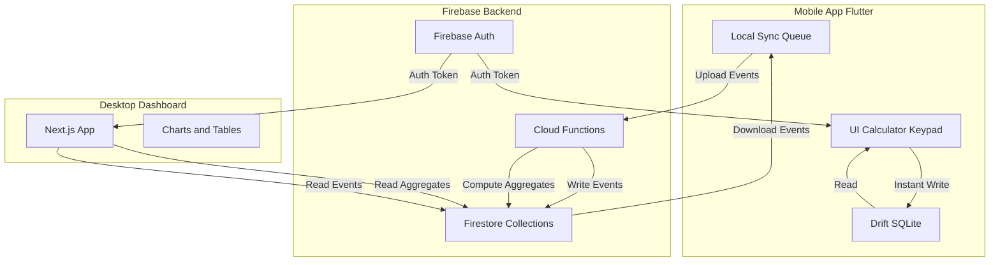

# Budget Tracker App - Complete Build Plan

## Key Architecture Decisions (Quality & Correctness)

This plan incorporates critical design decisions for long-term data integrity and scalability:

1. **User Home Timezone:** Every user has a home timezone (set at signup, editable). All dayKey/monthKey computations use home timezone, not device timezone or UTC midnight. This ensures consistent aggregation regardless of travel or DST transitions.

2. **Subcollection-Based Aggregates:** Aggregates use Firestore subcollections (e.g., `aggregates_monthly/{monthKey}/byCategory/{categoryId}`) instead of large map fields. This avoids the 1MB Firestore document limit and scales to thousands of categories/businesses.

3. **Server-Authoritative Projection:** Server maintains `transactions_current/{txnId}` projection with latest known state. For UPDATE/DELETE events, server reads previous state from this projection (not client-provided beforePayload). This prevents client manipulation and ensures aggregate correctness.

4. **Standardized Budget Model:** All budget calculations follow a single deterministic formula: `expectedToDate = budgetAmount * (dayIndex / daysInPeriod)`, `netPosition = expectedToDate - spentToDate`, `recommendedDaily = max(0, (budgetAmount - spentToDate) / daysRemaining)`. No ambiguity, fully testable.

5. **Client-Side Firebase Auth (Dashboard):** Dashboard uses Firebase client-side auth with protected routes (no session cookies, no NextAuth). Keeps auth consistent with mobile, simpler deployment, Firestore Security Rules enforce server-side access control.

6. **Composite Sync Cursor:** Download sync uses `(serverTimestamp, eventId)` composite cursor instead of simple timestamp. Eliminates ambiguity when multiple events have the same serverTimestamp, guarantees deterministic resume.

---

## High-Level Architecture



**Key principles:**

- **Local-first**: Mobile UI reads/writes to Drift exclusively
- **Event sourcing**: Immutable CREATE/UPDATE/DELETE events
- **Derived state**: Aggregates computed server-side from server-authoritative projections, can be rebuilt
- **Conflict resolution**: Last-write-wins by server timestamp per transactionId
- **Multi-device**: Sync queue ensures eventual consistency
- **Timezone-aware**: All day/month calculations use user's home timezone, not UTC midnight
- **Server-authoritative aggregates**: Server maintains current transaction state; aggregates derive from server projection, not client-declared beforePayload

---

## Repository Setup

### Monorepo Structure (Recommended)

**Rationale**: Shared TypeScript types between Functions and Dashboard, unified Firebase config, single version control, easier CI/CD.

**Recommended structure:**

```
budget-tracker/
├── mobile/           # Flutter app
├── dashboard/        # Next.js app
├── functions/        # Cloud Functions (TypeScript)
├── shared/           # Shared types/schemas (TypeScript)
├── firebase.json     # Firebase config
├── .firebaserc       # Firebase project IDs
└── README.md
```

### Initial Setup Commands (Windows PowerShell)

**Prerequisites check:**

- Flutter SDK installed (`flutter --version`)
- Node.js 18+ installed (`node --version`)
- Firebase CLI installed (`npm install -g firebase-tools`)
- Git installed

**Step-by-step initialization:**

1. **Create root directory and initialize Git:**
   ```powershell
   mkdir budget-tracker
   cd budget-tracker
   git init
   ```

2. **Initialize Firebase project:**
   ```powershell
   firebase login
   firebase init
   # Select: Functions, Firestore, Emulators, Hosting
   # Language: TypeScript
   # Emulators: Auth, Functions, Firestore, Hosting
   ```

3. **Create Flutter app:**
   ```powershell
   flutter create mobile
   cd mobile
   flutter pub add drift drift_flutter sqlite3_flutter_libs
   flutter pub add --dev drift_dev build_runner
   flutter pub add firebase_core firebase_auth cloud_firestore
   flutter pub add shared_preferences connectivity_plus
   cd ..
   ```

4. **Create Next.js dashboard:**
   ```powershell
   npx create-next-app@latest dashboard --typescript --tailwind --app --no-src-dir
   cd dashboard
   npm install firebase recharts date-fns
   npm install -D @types/node
   cd ..
   ```

5. **Create shared types package:**
   ```powershell
   mkdir shared
   cd shared
   npm init -y
   # Edit package.json to set "type": "module"
   cd ..
   ```

6. **Setup Firebase Functions dependencies:**
   ```powershell
   cd functions
   npm install firebase-admin firebase-functions
   cd ..
   ```

7. **Create root `.gitignore`:**

   - Add: `node_modules/`, `*.log`, `.env`, `mobile/build/`, `dashboard/.next/`, etc.

---

## Directory Structure

### Mobile (`mobile/`)

```
mobile/
├── lib/
│   ├── main.dart
│   ├── models/
│   │   ├── transaction.dart
│   │   ├── business.dart
│   │   ├── category.dart
│   │   ├── payment_method.dart
│   │   └── budget.dart
│   ├── database/
│   │   ├── app_database.dart      # Drift database definition
│   │   ├── app_database.g.dart    # Generated
│   │   └── dao/
│   │       ├── transactions_dao.dart
│   │       ├── businesses_dao.dart
│   │       └── sync_queue_dao.dart
│   ├── services/
│   │   ├── auth_service.dart
│   │   ├── sync_service.dart
│   │   ├── budget_service.dart
│   │   └── aggregates_service.dart
│   ├── screens/
│   │   ├── amount_entry_screen.dart
│   │   ├── payment_method_screen.dart
│   │   ├── category_screen.dart
│   │   ├── business_selector_screen.dart
│   │   ├── history_screen.dart
│   │   └── settings_screen.dart
│   └── widgets/
│       ├── calculator_keypad.dart
│       ├── budget_progress_bar.dart
│       └── payment_button.dart
├── test/
└── pubspec.yaml
```

### Dashboard (`dashboard/`)

```
dashboard/
├── app/
│   ├── layout.tsx
│   ├── page.tsx
│   ├── login/
│   │   └── page.tsx
│   ├── dashboard/
│   │   ├── page.tsx
│   │   ├── transactions/
│   │   │   └── page.tsx
│   │   ├── analytics/
│   │   │   └── page.tsx
│   │   └── budgets/
│   │       └── page.tsx
├── components/
│   ├── charts/
│   │   ├── SpendingByCategory.tsx
│   │   ├── DailyTrendChart.tsx
│   │   └── BudgetProgressChart.tsx
│   ├── tables/
│   │   └── TransactionsTable.tsx
│   └── layout/
│       ├── Sidebar.tsx
│       └── Header.tsx
├── lib/
│   ├── firebase.ts
│   ├── auth.ts
│   └── queries/
│       ├── transactions.ts
│       └── aggregates.ts
└── types/
    └── index.ts
```

### Functions (`functions/`)

```
functions/
├── src/
│   ├── index.ts                    # Export all functions
│   ├── triggers/
│   │   └── onEventWrite.ts         # Single Firestore trigger for all events
│   ├── aggregates/
│   │   ├── aggregateHelpers.ts     # Compute dayKey/monthKey, read home timezone
│   │   ├── applyCreateEvent.ts     # Increment aggregates, write to transactions_current
│   │   ├── applyUpdateEvent.ts     # Read from transactions_current, compute delta, update
│   │   ├── applyDeleteEvent.ts     # Read from transactions_current, subtract, delete projection
│   │   └── recomputeAggregates.ts  # Manual backfill function
│   ├── sync/
│   │   ├── uploadEvents.ts         # HTTPS callable
│   │   └── downloadEvents.ts       # HTTPS callable
│   └── utils/
│       ├── validation.ts
│       ├── timezoneHelpers.ts      # Convert UTC to dayKey/monthKey using timezone
│       └── cursorHelpers.ts        # Composite cursor (timestamp, eventId) utilities
└── package.json
```

### Shared (`shared/`)

```
shared/
├── types/
│   ├── transaction.ts
│   ├── business.ts
│   ├── category.ts
│   ├── paymentMethod.ts
│   ├── budget.ts
│   └── aggregates.ts
└── package.json
```

---

## Detailed Milestones

### Milestone 1: Project Foundation & Auth

**Goal:** Set up all three projects (mobile, dashboard, functions), configure Firebase, implement authentication flow.

**Tasks:**

- [ ] Execute all repo setup commands from empty folder
- [ ] Create Firebase project in console (dev, staging, prod)
- [ ] Configure Firebase emulators (Auth, Firestore, Functions)
- [ ] Add Firebase config files to mobile and dashboard
- [ ] Implement Firebase Auth sign-in/sign-up in Flutter
- [ ] Capture user's home timezone at signup (auto-detect from device, allow manual override)
- [ ] Store home timezone in user profile (Firestore /users/{userId}/profile)
- [ ] Implement Firebase Auth sign-in/sign-up in Next.js dashboard (client-side Firebase Auth SDK)
- [ ] Create protected route middleware (client-side: check Firebase auth state, redirect if not authenticated)
- [ ] Test auth flow in emulators (register, login, logout)
- [ ] Create initial Firestore Security Rules (user-partitioned)

**Acceptance Criteria:**

- User can register with email/password on mobile and dashboard
- User can sign in and see authenticated home screen
- Unauthenticated users redirected to login
- Emulators run successfully with `firebase emulators:start`
- Security rules enforce per-user data access

**Testing Notes:**

- Test with multiple user accounts
- Test logout and re-login
- Test invalid credentials
- Test token refresh

**Security Notes:**

- Never store passwords in client code
- Use Firebase Auth ID tokens for backend verification
- Implement rate limiting on auth endpoints (Firebase default is good start)
- Dashboard uses Firebase client-side Auth SDK only (no session cookies, no NextAuth)
- Protected routes validate Firebase auth state on client-side using onAuthStateChanged
- Firestore Security Rules enforce server-side access control (all queries scoped by auth.uid)

**Rollback/Safety:**

- Keep emulators running locally until auth is stable
- Don't deploy to production until auth is fully tested
- Document how to reset emulator data

---

### Milestone 2: Core Data Models & Local Database

**Goal:** Define all data schemas, set up Drift database, implement local CRUD for transactions.

**Tasks:**

- [ ] Define shared TypeScript types in `shared/` (transaction, business, category, etc.)
- [ ] Define Drift table schemas for: transactions, businesses, categories, payment_methods, budgets, sync_queue, user_profile
- [ ] Add user_profile table: `{ userId, homeTimezone, createdAt, updatedAt }`
- [ ] Generate Drift code with `flutter pub run build_runner build`
- [ ] Implement preset categories (Food, Clothes, Tech, Convenience, Business, etc.)
- [ ] Implement preset payment methods (Cash, Credit Card 1, Credit Card 2, Debit, etc.)
- [ ] Create DAOs for each entity
- [ ] Implement stable ID generation (UUIDs) for all entities
- [ ] Seed database with preset categories/payment methods on first launch
- [ ] Implement timezone utilities: compute dayKey (YYYY-MM-DD) and monthKey (YYYY-MM) from UTC timestamp + user's home timezone
- [ ] Test local writes: create transaction, read back, verify data

**Acceptance Criteria:**

- Drift database initializes successfully
- All tables created with correct schema
- DAOs can insert/query/update/delete records
- Preset categories and payment methods available on first launch
- Stable IDs generated correctly (UUID v4)

**Testing Notes:**

- Unit tests for DAO methods
- Test database migrations (add a field, verify upgrade works)
- Test concurrent writes
- Verify constraints (foreign keys, not nulls)

**Security Notes:**

- Local database not encrypted in v1 (note for future: SQLCipher)
- Document that sensitive data should not be stored unencrypted
- Plan for device lock requirement in settings

**Rollback/Safety:**

- Database migrations must be reversible
- Keep schema version history documented
- Test downgrade path if user reverts app version

---

### Milestone 3: Mobile UI - Transaction Entry Flow

**Goal:** Build the core 2-3 tap transaction logging flow: amount → payment → category → saved.

**Tasks:**

- [ ] Create calculator keypad widget (digits, decimal, backspace, clear)
- [ ] Implement amount entry screen with keypad
- [ ] Create payment method selection screen (large tappable buttons)
- [ ] Create category selection screen (large tappable buttons)
- [ ] Add optional business selector (if user has businesses)
- [ ] Add optional text note field
- [ ] Wire up flow: amount → payment → category → save to Drift
- [ ] Show success feedback (animation, sound, haptic)
- [ ] Navigate back to amount entry after save
- [ ] Show today's spending summary on amount entry screen

**Acceptance Criteria:**

- User can log a transaction in 3 taps (amount → payment → category)
- Transaction saved to local Drift database instantly
- No network required for logging
- UI responds within 100ms
- User can add optional note
- User can select business if they have any

**Testing Notes:**

- Test with various amounts (decimal, large numbers, zero)
- Test with all payment methods and categories
- Test optional note entry
- Test business selection flow
- Test rapid consecutive entries (stress test)
- Test with airplane mode (offline)

**Security Notes:**

- Input validation: amount must be > 0, max reasonable value (e.g., 1,000,000)
- Sanitize text notes (prevent injection if displayed in web views)

**Rollback/Safety:**

- If save fails, show error and keep user on screen to retry
- Log errors locally for debugging

---

### Milestone 4: Sync Engine - Upload (Mobile → Firestore)

**Goal:** Implement sync queue that uploads local transactions to Firestore as immutable events.

**Tasks:**

- [ ] Design Firestore collections structure (users/{userId}/events/{eventId})
- [ ] Add server-side projection: `/users/{userId}/transactions_current/{txnId}` (stores latest server-known state)
- [ ] Create sync_queue table in Drift (tracks pending uploads)
- [ ] On transaction create/update/delete, add event to sync_queue
- [ ] Implement background sync service (periodic + on connectivity change)
- [ ] Create Cloud Function `uploadEvents` (callable, authenticated)
- [ ] Function validates event structure and userId
- [ ] Function writes events to Firestore with server timestamp
- [ ] Function updates `transactions_current` projection: CREATE/UPDATE writes current state, DELETE removes doc
- [ ] Implement idempotency: use eventId as document ID, use merge
- [ ] Mark events as synced in local sync_queue
- [ ] Handle errors: retry with exponential backoff, max attempts
- [ ] Test sync with emulator Firestore

**Acceptance Criteria:**

- Local transactions uploaded to Firestore within 30 seconds (when online)
- Events have server timestamps
- Duplicate uploads don't create duplicate Firestore docs
- Sync queue retries failed uploads
- User can see sync status (synced, pending, error)

**Testing Notes:**

- Test with network on/off
- Test with slow network (throttle in emulator)
- Test with multiple devices uploading simultaneously
- Test idempotency: upload same event twice, verify single doc
- Test with 100+ pending events

**Security Notes:**

- Firestore rules: only allow writes to `/users/{userId}/events/{eventId}` if `request.auth.uid == userId`
- Validate event structure server-side (amount > 0, valid IDs, timestamp reasonable)
- Rate limit uploads per user (e.g., max 1000 events/hour)

**Rollback/Safety:**

- If server rejects event, mark as error in sync_queue for manual review
- Implement "force resync" button in settings (clears sync_queue, re-uploads all)

---

### Milestone 5: Sync Engine - Download (Firestore → Mobile)

**Goal:** Implement download sync to pull events from other devices and apply them locally.

**Tasks:**

- [ ] Track composite sync cursor `(serverTimestamp, eventId)` in local preferences
- [ ] Create Cloud Function `downloadEvents` (callable, authenticated)
- [ ] Function queries events where `(serverTimestamp, eventId) > lastCursor` and `userId == request.auth.uid`
- [ ] Query logic: `WHERE serverTimestamp > cursor.timestamp OR (serverTimestamp == cursor.timestamp AND eventId > cursor.eventId)`
- [ ] Sort results by `(serverTimestamp ASC, eventId ASC)` for deterministic ordering
- [ ] Implement pagination (fetch 500 events at a time)
- [ ] Download and apply events to local Drift database
- [ ] Implement conflict resolution: last-write-wins by server timestamp
- [ ] DELETE events set `deletedAt` timestamp (soft delete/tombstone)
- [ ] UPDATE events replace local if server timestamp is newer
- [ ] CREATE events insert if not exists, or treat as UPDATE if exists
- [ ] Update composite sync cursor `(serverTimestamp, eventId)` after successful download
- [ ] Trigger sync on app foreground + periodic background sync

**Acceptance Criteria:**

- Events from other devices appear on current device within 1 minute
- Conflicts resolved correctly (last-write-wins)
- Deleted transactions marked as deleted, not shown in UI
- No duplicate transactions after sync
- Sync works with multiple devices editing same transaction

**Testing Notes:**

- Test with 2 devices: add transaction on device A, see on device B
- Test edit conflict: edit same transaction offline on both devices, sync, verify winner
- Test delete conflict: delete on A, edit on B offline, sync, verify delete wins
- Test large sync (1000+ events)
- Test interrupted sync (network drops mid-download)

**Security Notes:**

- Firestore rules: only allow reads from `/users/{userId}/events/` if `request.auth.uid == userId`
- Function validates userId matches auth token
- Don't expose other users' data in query results

**Rollback/Safety:**

- If download fails mid-sync, don't update sync cursor (retry from last known composite cursor point)
- Implement "full resync" option: delete all local data, re-download everything

---

### Milestone 6: Aggregates - Server-Side Computation

**Goal:** Cloud Functions compute daily/monthly/category/business aggregates on event writes.

**Tasks:**

- [ ] Design aggregates Firestore structure (subcollection-based to avoid 1MB doc limit):
  - `/users/{userId}/aggregates_daily/{dayKey_YYYY-MM-DD}` (summary totals only)
  - `/users/{userId}/aggregates_daily/{dayKey}/byCategory/{categoryId}`
  - `/users/{userId}/aggregates_daily/{dayKey}/byPayment/{paymentId}`
  - `/users/{userId}/aggregates_daily/{dayKey}/byBusiness/{businessId}`
  - `/users/{userId}/aggregates_monthly/{monthKey_YYYY-MM}` (summary totals only)
  - `/users/{userId}/aggregates_monthly/{monthKey}/byCategory/{categoryId}`
  - `/users/{userId}/aggregates_monthly/{monthKey}/byPayment/{paymentId}`
  - `/users/{userId}/aggregates_monthly/{monthKey}/byBusiness/{businessId}`
- [ ] dayKey and monthKey computed using user's home timezone (not UTC midnight)
- [ ] Create Firestore trigger on events collection: on write, update relevant aggregates
- [ ] Implement atomic increment/decrement for aggregates (use Firestore transactions)
- [ ] Handle CREATE event: read user's home timezone, compute dayKey/monthKey, increment subcollection docs, write to `transactions_current`
- [ ] Handle UPDATE event: read previous state from `transactions_current` (server-authoritative, not client-provided beforePayload), compute delta (subtract old, add new), update subcollections, update `transactions_current`. Server must be able to compute deltas even if client payload incomplete, ensuring aggregate correctness.
- [ ] Handle DELETE event: read previous state from `transactions_current`, subtract values from subcollections, delete from `transactions_current`
- [ ] Aggregates schema (summary doc): `{ totalAmount, transactionCount, personalAmount?, businessAmount?, lastUpdated }`
- [ ] Aggregates schema (subcollection doc): `{ amount, transactionCount, lastUpdated }`
- [ ] Create indexes on Firestore for efficient aggregate queries

**Acceptance Criteria:**

- Aggregates update within 5 seconds of event write
- Aggregates are accurate (match sum of transactions)
- Aggregates handle updates and deletes correctly
- Dashboard can query aggregates quickly (<500ms)

**Testing Notes:**

- Test aggregate accuracy: add 10 transactions, verify sum matches
- Test with update: change transaction amount, verify aggregate updates
- Test with delete: delete transaction, verify aggregate decrements
- Test cross-day/month boundaries
- Test with large datasets (10,000+ transactions)

**Security Notes:**

- Firestore rules: only allow reads from `/users/{userId}/aggregates/` if `request.auth.uid == userId`
- Aggregates computed server-side only (no client writes)
- Prevent client from manipulating aggregates

**Rollback/Safety:**

- Implement `recomputeAggregates` Cloud Function (HTTPS callable, authenticated)
- Function re-scans all events for a user/month, rebuilds aggregates from scratch
- Use for recovery if aggregates become inconsistent
- Add admin-only "recompute all users" function for disaster recovery

---

### Milestone 7: Budget System - Calculation & Tracking

**Goal:** Implement budget creation, tracking, and recommended daily spend calculations.

**Tasks:**

- [ ] Create budget schema in Drift: `{ id, userId, scope (overall/personal/business), businessId?, period (weekly/monthly), amount, startDate, active }`
- [ ] Sync budgets to Firestore (same as transactions)
- [ ] Implement budget creation UI in mobile
- [ ] Calculate current spending against budget (query aggregates using user's home timezone for dayKey/monthKey)
- [ ] Implement standardized budget calculation model:
  - `expectedToDate = budgetAmount * (dayIndex / daysInPeriod)`
  - `netPosition = expectedToDate - spentToDate` (positive = savings, negative = debt)
  - `recommendedDaily = max(0, (budgetAmount - spentToDate) / daysRemaining)`
- [ ] Display budget progress bars on home screen
- [ ] Show warnings when overspent (netPosition < 0)
- [ ] Show positive feedback when under budget (netPosition > 0)
- [ ] Show netPosition as "savings" or "overspend debt"
- [ ] Support multiple independent budgets (weekly AND monthly)
- [ ] Weekly budget uses same model with 7-day period

**Acceptance Criteria:**

- User can create budgets for overall, personal, and per-business scopes
- User can set weekly and/or monthly budgets
- Recommended daily spend updates daily
- Overspend reduces recommended daily for remaining period
- Under-spend contributes to monthly savings tracker
- Budget calculations are deterministic and correct

**Testing Notes:**

- Test edge cases: last day of month, first day of month
- Test timezone handling: user's home timezone used for dayKey/monthKey computation
- Test DST transitions: dayKey computation handles DST correctly (date-based, not time-based)
- Test with overspend: verify netPosition negative, recommended daily adjusts
- Test with under-spend: verify netPosition positive (savings)
- Test with multiple budgets active simultaneously
- Test monthly rollover (new month starts, budget resets)
- Test user traveling: transactions use home timezone for aggregation, not current device timezone

**Security Notes:**

- Budgets are user-private data (same security rules as transactions)
- Validate budget amounts (> 0, reasonable max)

**Rollback/Safety:**

- Budget changes are versioned (UPDATE events)
- User can view budget history
- Incorrect calculations can be fixed by recomputing aggregates

---

### Milestone 8: Business Management

**Goal:** Users can create/edit/delete businesses, assign transactions to businesses, view per-business analytics.

**Tasks:**

- [ ] Create business schema in Drift: `{ id, userId, name, icon, createdAt, deletedAt? }`
- [ ] Sync businesses to Firestore (same event model)
- [ ] Implement business CRUD UI in mobile settings
- [ ] Preset: "No business" / "Personal" is always available
- [ ] Add business selector to transaction entry flow (after category, before save)
- [ ] Default to personal, show list if user has businesses
- [ ] Store businessId in transaction events
- [ ] Update aggregates to include business-specific rollups
- [ ] Dashboard: filter transactions by business
- [ ] Dashboard: show per-business spending charts

**Acceptance Criteria:**

- User can create businesses with name and icon
- User can assign transactions to businesses during entry
- User can reassign transaction business via edit
- Business aggregates computed correctly
- Dashboard shows per-business breakdowns

**Testing Notes:**

- Test with 0, 1, 5, 20 businesses
- Test editing business name (transactions still linked by ID)
- Test deleting business (transactions remain, business marked deleted)
- Test filtering UI with large number of businesses

**Security Notes:**

- Business data is user-private (same security rules)
- Business IDs are stable (UUIDs), not user-controlled

**Rollback/Safety:**

- Business deletes are soft deletes (can be undeleted)
- Transactions keep businessId even if business deleted (for history)

---

### Milestone 9: Dashboard - Basic UI & Auth

**Goal:** Next.js dashboard with Firebase auth, layout, and navigation.

**Tasks:**

- [ ] Set up Firebase config in Next.js
- [ ] Implement Firebase Auth client-side (signInWithEmailAndPassword, signOut using Firebase JS SDK)
- [ ] Create protected route middleware/component (use onAuthStateChanged to check auth state, redirect if not authenticated)
- [ ] Design dashboard layout: sidebar, header, main content area
- [ ] Create navigation: Overview, Transactions, Analytics, Budgets, Settings
- [ ] Connect to Firestore (read-only client access using Firebase JS SDK, all queries scoped by auth.uid)
- [ ] Test authentication flow (sign in, sign out, session persistence)
- [ ] Deploy to Firebase Hosting or Vercel (staging)

**Acceptance Criteria:**

- User can sign in with same credentials as mobile
- Unauthenticated users redirected to login
- Sidebar navigation works
- Dashboard layout is responsive (works on tablet/desktop)

**Testing Notes:**

- Test sign-in/out
- Test session persistence (refresh page)
- Test with multiple browsers
- Dashboard reads data via Firestore queries filtered by auth.uid OR via callable HTTPS functions where needed
- Server-side API routes (Cloud Functions) verify Firebase ID tokens via Authorization header when applicable

**Security Notes:**

- Protect all dashboard routes with auth checks (client-side onAuthStateChanged listener)
- Validate Firebase auth state for all Firestore queries (Firestore Security Rules enforce server-side)
- Use Firebase client-side Auth SDK only (no session cookies, no server-side auth, no NextAuth)
- All Firestore queries automatically scoped by auth.uid via Security Rules
- Sensitive write operations go through Cloud Functions (uploadEvents, etc.), not direct Firestore writes

**Rollback/Safety:**

- Don't expose API keys in client code (use environment variables)

---

### Milestone 10: Dashboard - Transactions Table

**Goal:** Display all transactions in a searchable, filterable, sortable table.

**Tasks:**

- [ ] Create transactions table component (show date, amount, category, payment, business, note)
- [ ] Implement pagination (show 50 per page)
- [ ] Implement filters: date range, category, payment method, business, personal/business toggle
- [ ] Implement sorting: by date, amount, category
- [ ] Implement search: by note text
- [ ] Query Firestore events efficiently (use indexes)
- [ ] Show transaction details in modal on click
- [ ] Implement edit transaction: opens modal, creates UPDATE event via uploadEvents Cloud Function
- [ ] Implement delete transaction: soft delete, creates DELETE event via uploadEvents Cloud Function
- [ ] Date filtering uses user's home timezone for dayKey computation

**Acceptance Criteria:**

- Table shows all user transactions
- Filters and sorting work correctly
- Edit/delete work and sync back to mobile
- Performance is good with 10,000+ transactions (use pagination)

**Testing Notes:**

- Test with large datasets
- Test filters and search with various inputs
- Test edit/delete and verify sync to mobile
- Test date range filters across month boundaries

**Security Notes:**

- All queries must filter by `userId == auth.uid`
- Validate edit/delete permissions server-side

**Rollback/Safety:**

- Edits are versioned (UPDATE events, keep history)
- Deletes are soft (can be undeleted)

---

### Milestone 11: Dashboard - Charts & Analytics

**Goal:** Display spending trends with charts: daily trend, category breakdown, payment method breakdown, business comparison.

**Tasks:**

- [ ] Install Recharts (or similar charting library)
- [ ] Create daily spending line chart (last 30 days, using daily aggregates with dayKey)
- [ ] Create category pie chart (current month, query byCategory subcollection)
- [ ] Create payment method bar chart (current month, query byPayment subcollection)
- [ ] Create business comparison chart (current month, query byBusiness subcollection)
- [ ] Query precomputed aggregates from subcollections (fast, scalable)
- [ ] Add date range selector (this month, last month, last 3 months, custom)
- [ ] Add scope selector (overall, personal, specific business)
- [ ] Show key metrics: total spent, avg daily, highest category, lowest day
- [ ] All date calculations use user's home timezone

**Acceptance Criteria:**

- Charts load within 500ms
- Charts update when date range or scope changes
- Charts are accurate (match transaction totals)
- Charts are responsive and look good

**Testing Notes:**

- Test with various date ranges
- Test with empty data (show "no data" message)
- Test with single transaction
- Test with large datasets

**Security Notes:**

- All aggregate queries must filter by `userId == auth.uid`

**Rollback/Safety:**

- If aggregates are wrong, use recompute function

---

### Milestone 12: Dashboard - Budget Management

**Goal:** Dashboard UI to create, edit, and view budgets; show budget progress.

**Tasks:**

- [ ] Create budget list page (show all active budgets)
- [ ] Create budget creation form (scope, period, amount, start date)
- [ ] Create budget edit/delete UI
- [ ] Show budget progress bars with current spending (using standardized budget model)
- [ ] Show recommended daily spend (`max(0, (budgetAmount - spentToDate) / daysRemaining)`)
- [ ] Show netPosition as savings (positive) or overspend debt (negative)
- [ ] Show historical budget performance (past months)
- [ ] Sync budget changes back to mobile via uploadEvents Cloud Function
- [ ] All budget calculations use user's home timezone

**Acceptance Criteria:**

- User can manage budgets from dashboard
- Budget progress is accurate
- Changes sync to mobile within 1 minute

**Testing Notes:**

- Test creating budgets on dashboard, verify on mobile
- Test editing budgets on mobile, verify on dashboard
- Test budget calculations match mobile

**Security Notes:**

- Budget writes must validate userId

**Rollback/Safety:**

- Budget changes are versioned

---

### Milestone 13: Category & Payment Method Customization

**Goal:** Users can add custom categories and payment methods (but not delete presets).

**Tasks:**

- [ ] Create category/payment method management UI in mobile settings
- [ ] Allow user to add custom entries (name, icon/color)
- [ ] Store custom entries in Drift and sync to Firestore
- [ ] Preset entries are flagged as `isPreset: true`, cannot be deleted
- [ ] User can delete custom entries (soft delete)
- [ ] User can reorder entries for display (store sortOrder)
- [ ] Update transaction entry UI to show custom entries
- [ ] Dashboard shows custom entries in filters

**Acceptance Criteria:**

- User can add custom categories/payment methods
- Presets cannot be deleted
- Custom entries sync across devices
- Custom entries appear in all relevant UIs

**Testing Notes:**

- Test adding custom entries on mobile, verify on dashboard
- Test deleting custom entries, verify tombstone behavior
- Test reordering

**Security Notes:**

- Validate custom entry names (max length, no special chars)
- Prevent malicious icon URLs (if allowing custom icons)

**Rollback/Safety:**

- Custom entry deletes are soft (can be undeleted)

---

### Milestone 14: Transaction Edit/Delete (Mobile)

**Goal:** Mobile app can edit and delete transactions, creating UPDATE/DELETE events.

**Tasks:**

- [ ] Create transaction history screen (list past transactions)
- [ ] Add swipe actions: edit, delete
- [ ] Edit opens transaction in edit mode (pre-filled form)
- [ ] Save edit creates UPDATE event (only afterPayload provided; server reads beforePayload from transactions_current)
- [ ] Delete creates DELETE event (soft delete)
- [ ] Update local Drift transaction
- [ ] Sync events to Firestore
- [ ] Show deleted transactions in history (grayed out) with "undo" option

**Acceptance Criteria:**

- User can edit any transaction field
- User can delete transactions
- Edits/deletes sync to other devices and dashboard
- Undo delete works (creates new CREATE event or unmarks deleted)

**Testing Notes:**

- Test editing amount, category, payment, business, note
- Test deleting and undoing
- Test edit/delete with offline device, sync later
- Test conflict: edit on device A, delete on device B offline, sync

**Security Notes:**

- Validate edit permissions (user owns transaction)
- Validate UPDATE event structure

**Rollback/Safety:**

- UPDATE events only store afterPayload (new state); server reads beforePayload from transactions_current projection
- DELETE events are soft (can be undeleted)
- Full audit trail via event log

---

### Milestone 15: Testing & Edge Cases

**Goal:** Comprehensive testing of sync, conflicts, edge cases, and data integrity.

**Tasks:**

- [ ] Test timezone changes (user travels)
- [ ] Test DST transitions (spring forward, fall back)
- [ ] Test month boundaries (transaction on last day of month)
- [ ] Test leap years (Feb 29)
- [ ] Test partial sync failures (network drops mid-upload)
- [ ] Test rapid edits (edit same transaction 10 times quickly)
- [ ] Test offline editing on 3 devices, sync all at once
- [ ] Test duplicate detection (upload same event twice)
- [ ] Test large datasets (100,000+ transactions)
- [ ] Test aggregate accuracy with recompute function
- [ ] Test budget calculations across month boundaries
- [ ] Test device storage limits (low disk space)
- [ ] Test background sync on iOS (limited background time)
- [ ] Test background sync on Android (Doze mode)

**Acceptance Criteria:**

- All edge cases handled gracefully
- No data loss or corruption
- Aggregates remain accurate
- Sync is robust

**Testing Notes:**

- Use emulators for time travel (change system date)
- Use network throttling for slow connections
- Use multiple test accounts
- Use automation for load testing

**Security Notes:**

- Test for injection attacks (XSS in notes, SQL in amounts)
- Test for privilege escalation (access other user's data)

**Rollback/Safety:**

- Document all edge cases and resolutions
- Provide recovery tools (recompute, full resync)

---

### Milestone 16: Performance Optimization

**Goal:** Optimize app performance, reduce battery drain, minimize network usage.

**Tasks:**

- [ ] Implement efficient Firestore queries (use indexes, limit results)
- [ ] Implement pagination for large datasets
- [ ] Optimize Drift queries (indexes, query plans)
- [ ] Reduce sync frequency (only sync when needed, not on timer)
- [ ] Implement incremental sync (only fetch new data)
- [ ] Optimize Cloud Functions (reduce cold starts, use caching)
- [ ] Optimize dashboard loading (preload aggregates, lazy load charts)
- [ ] Implement image/icon caching
- [ ] Reduce app bundle size (remove unused dependencies)
- [ ] Profile battery usage on mobile
- [ ] Profile network usage (aim for <1MB/day normal usage)

**Acceptance Criteria:**

- App launches in <2 seconds
- Transaction entry completes in <100ms
- Sync completes in <10 seconds for typical day's data
- Dashboard loads in <3 seconds
- Battery drain is minimal (<5% per hour active use)

**Testing Notes:**

- Use profiling tools (Flutter DevTools, Firebase Performance Monitoring)
- Test on low-end devices
- Test with slow network

**Security Notes:**

- Ensure optimizations don't bypass security checks

**Rollback/Safety:**

- Monitor performance metrics after each optimization
- Rollback if optimization introduces bugs

---

### Milestone 17: Security Hardening

**Goal:** Comprehensive security audit and hardening.

**Tasks:**

- [ ] Audit Firestore Security Rules (least privilege, no gaps)
- [ ] Audit Cloud Functions (input validation, auth checks)
- [ ] Implement rate limiting on all Functions (use Firebase App Check)
- [ ] Implement input sanitization (XSS, SQL injection prevention)
- [ ] Verify no CSRF vulnerabilities (Firebase client-side auth eliminates CSRF risk because no cookies/sessions are used; server endpoints must verify Firebase ID tokens)
- [ ] Confirm dashboard auth model is token-based (Firebase Auth client-side; no cookies/sessions → CSRF not applicable). Ensure any server endpoints verify Firebase ID tokens.
- [ ] Audit dependencies for vulnerabilities (npm audit, flutter pub outdated)
- [ ] Implement logging and monitoring (detect abuse)
- [ ] Implement data export (GDPR compliance)
- [ ] Implement account deletion (GDPR compliance)
- [ ] Document security model and threat mitigations

**Acceptance Criteria:**

- Security rules pass Firebase Emulator tests
- No known vulnerabilities in dependencies
- Rate limiting prevents abuse
- User data is private and secure

**Testing Notes:**

- Attempt to access other user's data (should fail)
- Attempt to bypass auth (should fail)
- Attempt to spam Functions (should be rate limited)
- Test data export and deletion

**Security Notes:**

- This is the comprehensive security milestone
- Document all security decisions

**Rollback/Safety:**

- Security hardening should not break functionality
- Test thoroughly before deploying

---

### Milestone 18: Deployment - Staging

**Goal:** Deploy all services to Firebase staging environment.

**Tasks:**

- [ ] Create Firebase staging project
- [ ] Configure staging Firestore, Auth, Functions
- [ ] Deploy Functions to staging: `firebase deploy --only functions --project staging`
- [ ] Deploy Firestore rules: `firebase deploy --only firestore:rules --project staging`
- [ ] Deploy Firestore indexes: `firebase deploy --only firestore:indexes --project staging`
- [ ] Deploy dashboard to staging (Firebase Hosting or Vercel)
- [ ] Build and test mobile app against staging (TestFlight for iOS, internal test for Android)
- [ ] Test full end-to-end flow on staging
- [ ] Monitor staging logs and errors
- [ ] Invite beta testers

**Acceptance Criteria:**

- Staging environment is fully functional
- All services communicate correctly
- Beta testers can access and use staging app
- No critical errors in logs

**Testing Notes:**

- Test with real devices (not emulators)
- Test with real network conditions
- Test with beta testers (collect feedback)

**Security Notes:**

- Staging should have same security as production
- Use separate Firebase project (not production)
- Don't expose staging to public

**Rollback/Safety:**

- Keep staging isolated from production
- Document staging environment setup
- Can wipe and rebuild staging anytime

---

### Milestone 19: Deployment - Production

**Goal:** Deploy to production, launch to real users.

**Tasks:**

- [ ] Create Firebase production project
- [ ] Configure production Firestore, Auth, Functions (with production quotas and billing)
- [ ] Deploy Functions to production
- [ ] Deploy Firestore rules and indexes
- [ ] Deploy dashboard to production (custom domain, SSL)
- [ ] Build production mobile apps (release builds)
- [ ] Submit iOS app to App Store
- [ ] Submit Android app to Google Play
- [ ] Set up monitoring and alerting (Firebase Crashlytics, Cloud Monitoring)
- [ ] Set up backup strategy (Firestore exports to Cloud Storage)
- [ ] Document deployment process
- [ ] Create runbooks for common issues

**Acceptance Criteria:**

- Production environment is live
- Apps available on App Store and Google Play
- Dashboard accessible at production URL
- Monitoring and alerting configured
- Backups running daily

**Testing Notes:**

- Test production environment thoroughly before launch
- Soft launch to small group first
- Monitor metrics closely after launch

**Security Notes:**

- Production has strictest security rules
- Enable Firebase App Check for production
- Set up DDoS protection
- Enable audit logging

**Rollback/Safety:**

- Document rollback procedure
- Keep previous versions deployable
- Can revert Functions, rules, and frontend quickly
- Mobile apps take longer to rollback (app store review)

---

### Milestone 20: Monitoring & Iteration

**Goal:** Monitor production, fix bugs, iterate based on user feedback.

**Tasks:**

- [ ] Monitor Firebase Crashlytics (mobile crashes)
- [ ] Monitor Cloud Functions logs (errors, latency)
- [ ] Monitor Firestore usage (read/write counts, costs)
- [ ] Monitor dashboard analytics (page views, errors)
- [ ] Set up alerts for critical errors
- [ ] Collect user feedback (in-app feedback form, support email)
- [ ] Triage and prioritize bugs
- [ ] Iterate on UX based on feedback
- [ ] Plan v2 features based on usage patterns

**Acceptance Criteria:**

- Monitoring dashboards show key metrics
- Critical alerts notify team immediately
- User feedback is collected and reviewed
- Bugs are fixed within reasonable timeframes

**Testing Notes:**

- Test monitoring by triggering test errors
- Test alerting by simulating failures

**Security Notes:**

- Monitor for abuse patterns (unusual API usage)
- Review security logs regularly

**Rollback/Safety:**

- Monitoring helps detect issues early
- Fast rollback capability for critical bugs

---

## Data Schema Details

### Drift Tables (Mobile SQLite)

**transactions**

```
id: TEXT PRIMARY KEY (UUID)
userId: TEXT NOT NULL
amount: REAL NOT NULL
categoryId: TEXT NOT NULL
paymentMethodId: TEXT NOT NULL
businessId: TEXT NULL (null = personal)
note: TEXT NULL
transactionDate: INTEGER NOT NULL (Unix timestamp)
createdAt: INTEGER NOT NULL
updatedAt: INTEGER NOT NULL
deletedAt: INTEGER NULL (tombstone)
syncStatus: TEXT (pending, synced, error)
```

**businesses**

```
id: TEXT PRIMARY KEY (UUID)
userId: TEXT NOT NULL
name: TEXT NOT NULL
icon: TEXT NOT NULL
createdAt: INTEGER NOT NULL
updatedAt: INTEGER NOT NULL
deletedAt: INTEGER NULL
```

**categories**

```
id: TEXT PRIMARY KEY (UUID)
userId: TEXT NULL (null = preset)
name: TEXT NOT NULL
icon: TEXT NOT NULL
isPreset: INTEGER NOT NULL (0/1)
sortOrder: INTEGER NOT NULL
createdAt: INTEGER NOT NULL
deletedAt: INTEGER NULL
```

**payment_methods**

```
id: TEXT PRIMARY KEY (UUID)
userId: TEXT NULL (null = preset)
name: TEXT NOT NULL
icon: TEXT NOT NULL
isPreset: INTEGER NOT NULL (0/1)
sortOrder: INTEGER NOT NULL
createdAt: INTEGER NOT NULL
deletedAt: INTEGER NULL
```

**budgets**

```
id: TEXT PRIMARY KEY (UUID)
userId: TEXT NOT NULL
scope: TEXT NOT NULL (overall, personal, business)
businessId: TEXT NULL (required if scope=business)
period: TEXT NOT NULL (weekly, monthly)
amount: REAL NOT NULL
startDate: INTEGER NOT NULL
active: INTEGER NOT NULL (0/1)
createdAt: INTEGER NOT NULL
updatedAt: INTEGER NOT NULL
deletedAt: INTEGER NULL
```

**sync_queue**

```
id: INTEGER PRIMARY KEY AUTOINCREMENT
eventId: TEXT NOT NULL UNIQUE
eventType: TEXT NOT NULL (CREATE, UPDATE, DELETE)
entityType: TEXT NOT NULL (transaction, business, category, payment_method, budget)
entityId: TEXT NOT NULL
payload: TEXT NOT NULL (JSON)
status: TEXT NOT NULL (pending, synced, error)
attempts: INTEGER NOT NULL DEFAULT 0
lastAttemptAt: INTEGER NULL
createdAt: INTEGER NOT NULL
```

**user_profile**

```
userId: TEXT PRIMARY KEY
homeTimezone: TEXT NOT NULL (IANA timezone, e.g., America/New_York)
createdAt: INTEGER NOT NULL
updatedAt: INTEGER NOT NULL
```

**Indexes:**

- transactions: (userId, transactionDate, deletedAt)
- transactions: (userId, categoryId, deletedAt)
- transactions: (userId, businessId, deletedAt)
- sync_queue: (status, createdAt)

### Firestore Collections

**Structure:**

```
/users/{userId}/
  /profile
    - homeTimezone: string (IANA timezone)
    - createdAt: serverTimestamp
    - updatedAt: serverTimestamp
  
  /events/{eventId}
    - eventType: CREATE | UPDATE | DELETE
    - entityType: transaction | business | category | payment_method | budget
    - entityId: UUID
    - userId: string
    - payload: object (full entity data for CREATE/UPDATE, minimal for DELETE)
    - createdAt: clientTimestamp
    - serverTimestamp: serverTimestamp (for ordering)
  
  /transactions_current/{transactionId}
    - (full transaction state as known by server)
    - amount: number
    - categoryId: string
    - paymentMethodId: string
    - businessId: string | null
    - note: string | null
    - transactionDate: timestamp
    - updatedAt: serverTimestamp
    - (used by server to compute deltas for UPDATE/DELETE events)
  
  /aggregates_daily/{dayKey_YYYY-MM-DD}
    - dayKey: string (YYYY-MM-DD in user's home timezone)
    - totalAmount: number
    - transactionCount: number
    - personalAmount: number
    - lastUpdated: serverTimestamp
    
  /aggregates_daily/{dayKey}/byCategory/{categoryId}
    - amount: number
    - transactionCount: number
    - lastUpdated: serverTimestamp
    
  /aggregates_daily/{dayKey}/byPayment/{paymentId}
    - amount: number
    - transactionCount: number
    - lastUpdated: serverTimestamp
    
  /aggregates_daily/{dayKey}/byBusiness/{businessId}
    - amount: number
    - transactionCount: number
    - lastUpdated: serverTimestamp
  
  /aggregates_monthly/{monthKey_YYYY-MM}
    - monthKey: string (YYYY-MM in user's home timezone)
    - totalAmount: number
    - transactionCount: number
    - personalAmount: number
    - businessAmount: number
    - lastUpdated: serverTimestamp
    
  /aggregates_monthly/{monthKey}/byCategory/{categoryId}
    - amount: number
    - transactionCount: number
    - lastUpdated: serverTimestamp
    
  /aggregates_monthly/{monthKey}/byPayment/{paymentId}
    - amount: number
    - transactionCount: number
    - lastUpdated: serverTimestamp
    
  /aggregates_monthly/{monthKey}/byBusiness/{businessId}
    - amount: number
    - transactionCount: number
    - lastUpdated: serverTimestamp
```

**Indexes:**

- events: (userId, serverTimestamp, eventId) for cursor-based pagination
- events: (userId, entityType, serverTimestamp)
- transactions_current: (userId) for efficient lookups
- aggregates_daily: (userId, dayKey)
- aggregates_monthly: (userId, monthKey)

**Firestore Security Rules:**

```
rules_version = '2';
service cloud.firestore {
  match /databases/{database}/documents {
    // User data is private
    match /users/{userId} {
      // Only the user can read their data
      allow read: if request.auth != null && request.auth.uid == userId;
      
      // Profile can be read/written by user
      match /profile {
        allow write: if request.auth != null && request.auth.uid == userId;
      }
      
      // Events can only be written by Cloud Functions (not clients)
      match /events/{eventId} {
        allow write: if false; // Only Functions can write
      }
      
      // Transactions_current can only be written by Cloud Functions
      match /transactions_current/{txnId} {
        allow write: if false; // Only Functions can write
      }
      
      // Aggregates can only be written by Cloud Functions
      match /aggregates_daily/{dayKey} {
        allow write: if false; // Only Functions can write
        match /byCategory/{categoryId} {
          allow write: if false;
        }
        match /byPayment/{paymentId} {
          allow write: if false;
        }
        match /byBusiness/{businessId} {
          allow write: if false;
        }
      }
      
      match /aggregates_monthly/{monthKey} {
        allow write: if false; // Only Functions can write
        match /byCategory/{categoryId} {
          allow write: if false;
        }
        match /byPayment/{paymentId} {
          allow write: if false;
        }
        match /byBusiness/{businessId} {
          allow write: if false;
        }
      }
    }
  }
}
```

**Note:** Mobile app and dashboard use Cloud Functions (`uploadEvents`, `downloadEvents`) to write/read events. Direct Firestore writes are blocked. Dashboard reads aggregates and events directly (read-only).

---

## Sync Engine Design

### Local Event Queue Lifecycle

1. **Transaction Created/Updated/Deleted in UI**

   - Write to Drift `transactions` table immediately (UI reads from this)
   - Create event: `{ eventType, entityType, entityId, payload }`
   - Insert event into `sync_queue` with `status: pending`

2. **Background Sync Service (Triggered by)**

   - App foreground (on resume)
   - Connectivity change (offline → online)
   - Periodic timer (every 5 minutes if online)
   - Manual refresh

3. **Upload Cycle**

   - Query `sync_queue` where `status = pending` OR (`status = error` AND `attempts < 5`)
   - Batch events (up to 100 per upload)
   - Call Cloud Function `uploadEvents(events: Event[])`
   - Function validates, writes to Firestore with `serverTimestamp`
   - Function returns success/failure per event
   - Update `sync_queue`: set `status = synced` for successful events
   - Retry failed events with exponential backoff

4. **Download Cycle**

   - Get `lastSyncCursor (serverTimestamp, eventId)` from shared preferences
   - Call Cloud Function `downloadEvents(afterCursor: {timestamp, eventId})`
   - Function queries events where `(serverTimestamp, eventId) > afterCursor` AND `userId == request.auth.uid`
   - Function returns events in batches (paginated)
   - Apply events to local Drift database (see conflict resolution below)
   - Update `lastSyncCursor` to latest `(serverTimestamp, eventId)` received

### Upload/Download Strategy

**Upload (Mobile → Firestore):**

- **Idempotency:** Use `eventId` (UUID) as Firestore document ID. Firestore `set(..., { merge: true })` ensures duplicate uploads don't create multiple docs.
- **Ordering:** Client-side events have `createdAt` (client timestamp), but server adds `serverTimestamp` for authoritative ordering.
- **Batching:** Upload up to 100 events per call to reduce network round trips.
- **Retries:** Exponential backoff (1s, 2s, 4s, 8s, 16s), max 5 attempts. After 5 failures, mark as `error` and require manual intervention.

**Download (Firestore → Mobile):**

- **Incremental:** Only fetch events after composite sync cursor `(serverTimestamp, eventId)`.
- **Query Logic:** `WHERE serverTimestamp > cursor.timestamp OR (serverTimestamp == cursor.timestamp AND eventId > cursor.eventId)`
- **Ordering:** Sort by `(serverTimestamp ASC, eventId ASC)` to ensure consistent ordering even when timestamps collide.
- **Pagination:** Fetch 500 events per request. If more exist, continue fetching until all caught up.
- **Atomic Apply:** Process events in a Drift transaction to ensure consistency.
- **Cursor Persistence:** Store both serverTimestamp and eventId locally to guarantee resume consistency without missing or duplicating events.

### Idempotency Approach

**Upload Idempotency:**

- `eventId` is client-generated UUID, used as Firestore document ID.
- If network fails and client retries, Firestore will merge/overwrite existing doc (no duplicate).
- Cloud Function can additionally check if event already exists before processing (optional).

**Download Idempotency:**

- Track composite sync cursor `(serverTimestamp, eventId)` carefully. Only fetch events after this cursor.
- Composite cursor eliminates ambiguity when multiple events have the same serverTimestamp.
- Query logic: `WHERE serverTimestamp > cursor.timestamp OR (serverTimestamp == cursor.timestamp AND eventId > cursor.eventId)`
- If download is interrupted, next download starts from same cursor (may re-fetch some events).
- When applying events, check if event already applied (by eventId). If yes, skip or reapply (safe due to conflict resolution).

### Conflict Resolution Rules

**Conflict Scenario:** Same transaction edited offline on two devices, both devices sync.

**Resolution Strategy: Last-Write-Wins by Server Timestamp**

1. **CREATE Events:**

   - If transaction with `entityId` doesn't exist locally, insert it.
   - If it already exists (race: two devices created with same UUID, unlikely but possible), treat as UPDATE.

2. **UPDATE Events:**

   - Compare `serverTimestamp` of incoming event with local transaction's `updatedAt` (converted to server timestamp if previously synced).
   - If incoming event is newer, apply update (overwrite local fields).
   - If incoming event is older, ignore (local version wins).
   - **Important:** Client provides only afterPayload in UPDATE event. Server reads previous state from `transactions_current` projection to compute aggregate deltas.

3. **DELETE Events:**

   - Set `deletedAt` timestamp locally (soft delete).
   - DELETE events always win over CREATE/UPDATE if they have a later `serverTimestamp`.
   - If local transaction was deleted and incoming UPDATE has older timestamp, ignore UPDATE (delete wins).
   - If incoming DELETE has newer timestamp than local update, apply delete.

4. **Aggregate Corrections:**

   - Server maintains `transactions_current` projection with latest known state of each transaction.
   - When applying UPDATE, server reads previous state (beforePayload) from `transactions_current`, computes delta (subtract old, add new).
   - When applying DELETE, server reads state from `transactions_current`, subtracts values.
   - Client provides only afterPayload for UPDATE events; beforePayload is NOT sent by client (prevents client manipulation).
   - This ensures aggregates are eventually consistent and derived from server-authoritative data only.
   - Server-side delta computation safety: Cloud Functions compute deltas using server state from `transactions_current` projection. If beforePayload is missing or incomplete from client, server can still compute correct delta using its projection as source of truth. Clients send afterPayload for efficiency, but server remains authoritative.

**Special Case: DELETE vs UPDATE Conflict**

- Device A: Deletes transaction (creates DELETE event with timestamp T1)
- Device B: Updates transaction offline (creates UPDATE event)
- Device B syncs first (UPDATE applied with timestamp T2)
- Device A syncs (DELETE event with timestamp T1)
- Resolution: Compare timestamps. If T1 > T2, DELETE wins (set deletedAt). If T2 > T1, UPDATE wins (ignore old DELETE).

### Keeping Aggregates Correct with Edits/Deletes

**Strategy: Server-Side Aggregate Maintenance with Server-Authoritative Projection**

**On CREATE Event:**

- Firestore trigger: `onEventWrite` (listens to events collection)
- Read user's home timezone from `/users/{userId}/profile`
- Compute dayKey (YYYY-MM-DD) and monthKey (YYYY-MM) using home timezone
- Increment relevant aggregate subcollections: `aggregates_daily/{dayKey}/byCategory/{catId}`, etc.
- Use Firestore transactions for atomic increments.
- Write transaction state to `transactions_current/{txnId}` projection.

**On UPDATE Event:**

- Firestore trigger: `onEventWrite`
- Read previous state (beforePayload) from `transactions_current/{txnId}` (server-authoritative)
- Read new state (afterPayload) from event payload
- Compute dayKey/monthKey for both old and new transactionDate (using user's home timezone)
- Subtract old values from old date's aggregate subcollections
- Add new values to new date's aggregate subcollections
- Handle cases where date/category/payment/business changed (update multiple aggregates)
- Update `transactions_current/{txnId}` with new state

**On DELETE Event:**

- Firestore trigger: `onEventWrite`
- Read previous state from `transactions_current/{txnId}`
- Subtract values from aggregate subcollections (reverse of CREATE)
- Delete `transactions_current/{txnId}` document

**Edge Case: Out-of-Order Events**

- Events may arrive out of order due to network delays or multi-device sync.
- Server timestamps ensure correct ordering.
- `transactions_current` always reflects the latest known state (by serverTimestamp).
- Aggregates are eventually consistent (may be temporarily incorrect, but will converge).
- If aggregates become inconsistent, use `recomputeAggregates` function.

### "Recompute Aggregates" Safety Valve

**Purpose:** Rebuild aggregates from scratch when inconsistencies detected.

**Implementation:**

- Cloud Function: `recomputeAggregates(userId: string, month?: string)`
- Authenticated, callable by user from mobile or dashboard.
- Admin version: can recompute for all users (for disaster recovery).

**Algorithm:**

1. Query all events for userId (optionally filter by month).
2. Replay events in chronological order (by serverTimestamp, then eventId), building `transactions_current` state.
3. For each final transaction state, compute dayKey/monthKey using user's home timezone.
4. Recompute aggregate subcollections from scratch using final states.
5. Overwrite existing aggregate documents (both summary and subcollections) with recomputed values.
6. Return success/failure.

**When to Use:**

- User reports incorrect totals.
- After fixing a bug in aggregate logic (run for all users).
- As periodic sanity check (monthly cron job).

**Safety:**

- Read-only for events (source of truth).
- Overwrites aggregates (derived state, safe to rebuild).
- Idempotent (can run multiple times).

---

## Budget Calculation Design

### Standardized Budget Model

All budget calculations follow a single deterministic model to ensure consistency across mobile and dashboard.

**Core Definitions:**

- `budgetAmount`: Total budget for the period (e.g., $1000 for monthly)
- `daysInPeriod`: Total days in period (monthly: days in month, weekly: 7)
- `dayIndex`: Current day within period (1-indexed: day 1, day 2, etc.)
- `daysRemaining`: Days left including today (`daysInPeriod - dayIndex + 1`)
- `spentToDate`: Total spent from period start through today
- `expectedToDate`: Expected spend by today if on track (`budgetAmount * (dayIndex / daysInPeriod)`)
- `netPosition`: `expectedToDate - spentToDate` (positive = savings, negative = overspend debt)
- `recommendedDaily`: `max(0, (budgetAmount - spentToDate) / daysRemaining)`

**Key Principles:**

- Daily budgets reset each day (no rollover), but netPosition implicitly tracks savings/debt via expected-to-date math
- netPosition > 0 means user is under budget (savings)
- netPosition < 0 means user is over budget (debt)
- recommendedDaily adjusts dynamically based on remaining budget and days left

### Computing "Recommended Daily Spend"

**Inputs:**

- Budget amount (e.g., $1000)
- Budget period (weekly or monthly)
- Budget start date
- Current date (in user's home timezone)
- Total spent so far in period (from aggregates, using dayKey/monthKey in user's home timezone)

**Algorithm (Monthly Budget):**

```
currentMonthKey = compute monthKey (YYYY-MM) using user's home timezone
daysInMonth = total days in current month
dayOfMonth = current day (1-31, in user's home timezone)
dayIndex = dayOfMonth
daysRemaining = daysInMonth - dayOfMonth + 1

spentToDate = query aggregates_monthly/{currentMonthKey} totalAmount
expectedToDate = budgetAmount * (dayIndex / daysInMonth)
netPosition = expectedToDate - spentToDate

recommendedDaily = max(0, (budgetAmount - spentToDate) / daysRemaining)
```

**Algorithm (Weekly Budget):**

```
currentWeekStart = compute start of current ISO week in user's home timezone
dayOfWeek = current day within week (1=Monday, 7=Sunday)
dayIndex = dayOfWeek
daysRemaining = 7 - dayOfWeek + 1

spentToDate = sum of daily aggregates for days in current week
  (query aggregates_daily/{dayKey} for each day in week)
expectedToDate = budgetAmount * (dayIndex / 7)
netPosition = expectedToDate - spentToDate

recommendedDaily = max(0, (budgetAmount - spentToDate) / daysRemaining)
```

### Savings/Overspend Interaction (netPosition)

**Under-Spend (Savings):**

- `netPosition > 0` means user is ahead of expected pace
- Display as: "You're $X ahead of pace" or "Savings: $X"
- This is implicit from the expected-to-date formula; no separate daily tracking needed
- netPosition increases when user spends less than expected

**Overspend (Debt):**

- `netPosition < 0` means user is behind expected pace
- Display as: "You're $X over pace" or "Overspend debt: $X"
- recommendedDaily automatically adjusts to help user get back on track
- User sees warning: "You're $X over pace. Recommended daily: $Y to finish on budget."

**Example (Monthly $1000 budget, 30 days):**

- Day 1: Spent $20, expected $33.33, netPosition = +$13.33 (savings)
- Day 2: Spent $50 (total $70), expected $66.67, netPosition = -$3.33 (overspend debt)
- Day 3: Total spent $70, days remaining 28, recommended daily = ($1000 - $70) / 28 = $33.21
- Day 10: Total spent $300, expected $333.33, netPosition = +$33.33 (back on track)

**UI Display:**

- Show progress bar: `spentToDate / budgetAmount`
- Show recommendedDaily (updates daily)
- Show netPosition as "Savings: $X" (if positive) or "Over pace: $X" (if negative)
- Color code: green if netPosition > 0, red if netPosition < 0

### Weekly vs Monthly Interaction

**Independent Tracking:**

- User can set both a weekly budget ($250) and monthly budget ($1000).
- Each is tracked independently with its own progress bar.
- Each generates its own recommended daily spend.
- User might see: "Weekly: Spend $30/day. Monthly: Spend $25/day."
- This can be confusing, but user requested independent tracking.

**UI Strategy:**

- Show both budgets side-by-side.
- Highlight the more restrictive one (e.g., if weekly recommends $20 but monthly recommends $30, show $20 prominently).
- Or let user choose which budget to prioritize in settings.

**v1 Simplification:**

- Default: Users are encouraged to pick either weekly OR monthly (not both) for simplicity.
- But system supports both if user wants.

---

## Dashboard Plan

### v1 Charts and Tables

**Overview Page:**

- Key metrics cards: Total spent (month), Avg daily, Transactions count, Top category
- Daily spending trend line chart (last 30 days)
- Category breakdown pie chart (current month)
- Budget progress bars (all active budgets)

**Transactions Page:**

- Searchable, filterable, sortable table (see Milestone 10)
- Filters: date range, category, payment method, business, personal/business toggle
- Actions: View details, Edit, Delete

**Analytics Page:**

- Category breakdown chart (pie or bar)
- Payment method breakdown chart (bar)
- Business comparison chart (bar, if user has businesses)
- Time-based trends (monthly comparison, year-over-year)
- Date range selector
- Scope selector (overall, personal, specific business)

**Budgets Page:**

- List of budgets with progress bars (see Milestone 12)
- Create/edit/delete budget forms
- Historical budget performance chart

**Settings Page:**

- Account info
- Data export (CSV download)
- Account deletion
- Manage categories/payment methods
- Sync status

### v2 Features (Not in Initial Plan)

- **CSV Export:** Export transactions to CSV for external analysis (Milestone 21+)
- **Receipt Attachments:** Attach photos to transactions (requires storage, image sync)
- **Recurring Transactions:** Auto-create transactions on schedule (e.g., monthly rent)
- **Split Transactions:** Split one payment into multiple categories
- **Multi-Currency:** Support transactions in different currencies
- **Reports:** PDF reports, email summaries
- **Insights:** AI-powered spending insights and recommendations

### Querying Aggregates Efficiently

**Strategy:**

- Dashboard primarily reads precomputed aggregates from subcollections (fast, <500ms, scalable).
- Aggregates are indexed by (userId, dayKey/monthKey).
- For date range queries (e.g., last 3 months), query subcollections for each month, sum client-side.
- For category/payment/business breakdowns, query relevant subcollections (e.g., `aggregates_monthly/{monthKey}/byCategory/` subcollection, iterate all category docs).
- For drilling into specific transactions, query events collection with filters.
- Subcollection-based structure avoids Firestore 1MB document limit even with thousands of categories/businesses.

**Optimization:**

- Use Firestore indexes for common queries.
- Cache aggregates in browser localStorage (invalidate on data change).
- Use Next.js server-side rendering or static generation for faster initial load.
- Firestore subcollection queries are efficient and scale well (each doc is small: just counters).

---

## Deployment Plan

### Dev Environment (Local Emulators)

**Setup:**

- Firebase emulators running locally (Auth, Firestore, Functions)
- Mobile app points to emulator (`useEmulator` in Firebase config)
- Dashboard points to emulator
- No costs, fast iteration, full control

**Commands:**

```powershell
# Start emulators
firebase emulators:start

# Run mobile app (Android)
cd mobile
flutter run

# Run dashboard (Next.js)
cd dashboard
npm run dev
```

**Data Management:**

- Emulator data is ephemeral (resets on restart) unless using `--import/--export`.
- Use seed scripts to populate test data.

### Staging Environment

**Purpose:**

- Test with real Firebase services (not emulators).
- Beta testing with real users.
- Final QA before production.

**Setup:**

- Create Firebase project: `budget-tracker-staging`
- Configure Firestore, Auth, Functions with staging quotas.
- Deploy all services to staging.

**Commands:**

```powershell
# Deploy Functions
firebase deploy --only functions --project staging

# Deploy Firestore rules and indexes
firebase deploy --only firestore --project staging

# Deploy dashboard
firebase deploy --only hosting --project staging
# OR deploy to Vercel staging branch

# Build mobile apps
cd mobile
flutter build apk --release --flavor staging
flutter build ios --release --flavor staging
```

**Access:**

- Mobile: TestFlight (iOS), Internal Testing (Android)
- Dashboard: staging.budgettracker.com (or similar)

**Testing:**

- Invite 10-20 beta testers.
- Collect feedback, monitor crashes.
- Iterate quickly.

### Production Environment

**Setup:**

- Create Firebase project: `budget-tracker-prod`
- Configure Firestore with production quotas (budget for scale).
- Enable Firebase App Check (prevent abuse).
- Set up custom domain for dashboard.

**Commands:**

```powershell
# Deploy to production
firebase deploy --only functions,firestore,hosting --project prod

# Build production mobile apps
flutter build apk --release
flutter build ios --release

# Submit to stores
# iOS: Upload to App Store Connect, submit for review
# Android: Upload to Google Play Console, submit for review
```

**Monitoring:**

- Firebase Crashlytics (mobile crashes)
- Cloud Functions logs (Cloud Logging)
- Firestore metrics (Console)
- Dashboard analytics (Google Analytics or similar)
- Uptime checks (Cloud Monitoring)

**Backups:**

- Firestore exports to Cloud Storage (daily cron job).
- Retention: 30 days.
- Recovery: Import from backup if disaster.

**Rollback:**

- Functions: Deploy previous version with `firebase deploy --only functions`
- Firestore rules: Keep versioned in Git, redeploy previous version
- Dashboard: Revert Git commit, redeploy
- Mobile: Can't rollback easily (users must update), prioritize stability

**Launch Checklist:**

- [ ] All tests passing
- [ ] Security rules audited and tested
- [ ] Monitoring and alerting configured
- [ ] Backups enabled
- [ ] Custom domain configured (dashboard)
- [ ] App Store and Google Play listings complete
- [ ] Privacy policy and terms of service published
- [ ] Support email set up
- [ ] Soft launch to small group (100 users)
- [ ] Monitor for 1 week
- [ ] Full launch (public)

---

## Risks and Edge Cases

### Time Zones and DST

**Risk:** User travels across time zones, transactions logged in different time zones, aggregates become inconsistent.

**Mitigation:**

- Store all timestamps in UTC (Unix timestamps) for precision.
- Each user has a "home timezone" stored in profile (set at signup, editable).
- All dayKey (YYYY-MM-DD) and monthKey (YYYY-MM) computations use the user's home timezone, not device timezone.
- Aggregates are keyed by dayKey/monthKey derived from user's home timezone.
- Budget calculations use user's home timezone for all date math.
- Display in user's current device timezone (UI only), but aggregation uses home timezone.

**Rationale:** Home timezone provides a stable reference for aggregation regardless of where user travels. User can change home timezone in settings if they relocate permanently.

**Edge Case: DST transition (spring forward, fall back).**

- DST is handled automatically by timezone-aware date conversion.
- dayKey is date-based (YYYY-MM-DD), not time-based, so DST transitions don't cause duplicate or missing days.
- Example: In America/New_York, on DST transition day, midnight still maps to the correct date.
- Using dayKey instead of UTC day boundaries eliminates DST-related aggregation bugs.

**Edge Case: User changes home timezone.**

- Changing home timezone affects future transactions only (past aggregates remain in old timezone).
- Optionally, provide "recompute all aggregates" function to recalculate with new timezone (v2 feature).
- Document that changing home timezone may cause temporary inconsistencies until recompute runs.

### Duplicate Events

**Risk:** Network failure causes retry, duplicate events uploaded.

**Mitigation:**

- `eventId` (UUID) used as Firestore document ID (idempotent writes).
- Firestore `set(..., { merge: true })` prevents duplicates.
- Server-side deduplication: check if event already processed before updating aggregates (optional).

**Edge Case:** Two devices create transactions with same UUID (astronomically unlikely with UUIDv4).

- UUIDs have 122 bits of randomness, collision probability is negligible.
- If collision occurs (1 in 2^61 events), treat as conflict, last-write-wins.

### Partial Sync Failures

**Risk:** Network drops mid-upload or mid-download, sync incomplete.

**Mitigation:**

- **Upload:** Batch events, track sync status per event. If batch fails, retry unsynced events.
- **Download:** Use composite cursor `(serverTimestamp, eventId)`. If download interrupted, next sync continues from same cursor (may re-fetch some events, idempotent apply).
- **Atomic Apply:** Process downloaded events in a Drift transaction. If apply fails mid-way, rollback, retry from last known good state.

### Offline Edits and Merges

**Risk:** User edits same transaction on two devices while offline, both sync later.

**Mitigation:**

- Last-write-wins by `serverTimestamp` (see Conflict Resolution).
- UPDATE events store only afterPayload for audit trail. Server reads beforePayload from `transactions_current` projection.
- User can see edit history (future feature, not v1).

**Edge Case:** User deletes transaction on Device A, edits same transaction on Device B offline.

- Both sync: DELETE event (T1) and UPDATE event (T2).
- Resolution: Compare timestamps, apply winner (see Conflict Resolution).

### Month Boundaries

**Risk:** Transaction logged at 11:59 PM on last day of month, syncs at 12:01 AM next month. Which month's aggregate?

**Mitigation:**

- Transactions have `transactionDate` field (UTC timestamp, user-selected or auto-set at entry time).
- Aggregates use dayKey/monthKey computed from `transactionDate` + user's home timezone.
- Even if sync is delayed, transaction counts toward correct day/month based on transactionDate.
- Server computes dayKey/monthKey using user's home timezone stored in profile.

**Edge Case: User changes transaction date (edits transaction to different day).**

- UPDATE event triggers aggregate adjustment: subtract from old dayKey/monthKey, add to new dayKey/monthKey.
- Server reads old state from `transactions_current`, computes old dayKey, subtracts.
- Server reads new state from event, computes new dayKey, adds.

### Large Datasets and Performance

**Risk:** User has 100,000+ transactions, queries become slow, app lags.

**Mitigation:**

- **Mobile:** Drift indexes on key fields (userId, date, categoryId). SQLite handles 100K rows efficiently.
- **Firestore:** Aggregates precomputed in subcollections (fast reads, scalable). Querying 100K events directly is slow, but users query aggregates, not raw events.
- **Dashboard:** Pagination (show 50 transactions at a time). Use Firestore `limit()` and cursors.
- **Aggregates:** Aggregates are subcollection-based, avoiding 1MB document limit. Each category/payment/business is a separate document. Scales to thousands of categories/businesses without hitting limits.

**Edge Case: User logs 1000 transactions per day (edge case, but possible for business).**

- Daily aggregate summary doc still small (just totals: totalAmount, transactionCount, lastUpdated).
- Breakdown stored in subcollections (each category/payment/business is separate doc).
- Firestore can handle large subcollections efficiently (thousands of docs per subcollection).
- If a single category has 1000 transactions/day, that category's doc in byCategory subcollection is still small (just counters: amount, transactionCount).

### Device Storage Limits

**Risk:** Mobile device runs out of storage, Drift database can't grow.

**Mitigation:**

- Implement "archive old data" feature: move transactions older than 1 year to Firestore-only (delete from local Drift).
- Keep recent data local (last 3 months), fetch older data on-demand from Firestore.
- Not in v1, but design database schema to support this (soft deletes allow archiving).

### Background Sync Limitations

**Risk (iOS):** iOS limits background processing (15 minutes per day), sync may not run.

**Mitigation:**

- Prioritize foreground sync (on app resume).
- Use `background_fetch` plugin for periodic background sync (best effort).
- Notify user if sync is stale (e.g., "Last synced 2 hours ago").

**Risk (Android):** Doze mode restricts background activity.

**Mitigation:**

- Use `WorkManager` for periodic sync (Android respects Doze constraints).
- Sync on app foreground (guaranteed to run).
- User can manually trigger sync (pull-to-refresh).

### Rate Limiting and Abuse

**Risk:** Malicious user spams API, drives up costs.

**Mitigation:**

- Firebase App Check: verify requests come from genuine app.
- Cloud Functions rate limiting: max 1000 requests/hour per user.
- Firestore Security Rules: validate data structure, prevent malformed writes.
- Monitor usage, alert on anomalies.

**Edge Case:** Legitimate power user hits rate limit.

- Gracefully handle rate limit errors (show message, retry later).
- Increase limit for verified users (future).

### Data Export and GDPR

**Risk:** User requests data export or account deletion (GDPR requirement).

**Mitigation:**

- **Export:** Cloud Function to generate JSON/CSV of all user data, download from dashboard.
- **Deletion:** Cloud Function to delete all user data (events, aggregates), mark account as deleted in Auth.
- Implement in v1 (required for EU users).

### Account Recovery

**Risk:** User forgets password, loses access.

**Mitigation:**

- Firebase Auth handles password reset (email link).
- No local data backup (cloud-first), so user can recover by logging in on new device.

**Edge Case:** User loses all devices and forgets password.

- User must go through Firebase password reset.
- If email also lost, account is unrecoverable (document this in terms of service).

---

## Testing Strategy Summary

**Unit Tests:**

- Drift DAOs (insert, query, update, delete)
- Budget calculation logic (recommended daily, savings)
- Sync queue logic (enqueue, dequeue, retry)
- Firestore trigger functions (aggregate updates)

**Integration Tests:**

- Mobile → Firestore sync (upload events)
- Firestore → Mobile sync (download events)
- Conflict resolution (edit on two devices, sync)
- Aggregates accuracy (add transactions, verify sums)

**End-to-End Tests:**

- Full user flow: create transaction on mobile, see on dashboard
- Multi-device: add on Device A, edit on Device B, see on dashboard
- Offline: log transactions offline, sync when online, verify correct

**Load Tests:**

- 100,000 transactions per user (performance)
- 1000 concurrent users syncing (scalability)
- Large batch uploads (500 events at once)

**Security Tests:**

- Attempt to access other user's data (should fail)
- Attempt to write to Firestore directly (should fail)
- Attempt to bypass auth (should fail)

**Edge Case Tests:**

- Timezone changes, DST
- Month boundaries, leap years
- Partial sync failures, network interruptions
- Rapid edits, race conditions

---

## Success Metrics

**v1 Launch Goals:**

- **Functionality:** All core features working (transaction logging, sync, budgets, dashboard)
- **Performance:** Transaction entry <100ms, sync <10s, dashboard load <3s
- **Reliability:** 99.9% uptime, no data loss, no corruption
- **Security:** No vulnerabilities, Firestore rules enforced, rate limiting active
- **UX:** 2-3 tap transaction logging, intuitive UI, positive user feedback

**Post-Launch Metrics:**

- **Adoption:** 1000 users in first 3 months
- **Engagement:** 80% daily active users (among registered users)
- **Retention:** 50% users still active after 30 days
- **Sync Success Rate:** 99% events synced successfully
- **Aggregate Accuracy:** <0.1% users report incorrect totals
- **Crash Rate:** <1% sessions have crashes

---

## Next Steps After v1

- Collect user feedback, prioritize feature requests
- Implement v2 features (CSV export, receipt attachments, recurring transactions, etc.)
- Optimize performance based on real usage patterns
- Expand to web app (full-featured web version, not just dashboard)
- Implement advanced budgeting (envelope method, goal-based budgets)
- Add AI-powered insights and recommendations
- Integrate with bank APIs (Plaid) for automatic transaction import
- Support for teams/shared budgets (households, small businesses)

---

**End of Plan**

## Revision Summary

This plan has been revised to incorporate 6 critical improvements for long-term correctness and scalability:

1. **Timezone Handling:** User home timezone introduced. All dayKey/monthKey computations use home timezone (not device timezone or UTC midnight). DST handled via date-based keys (YYYY-MM-DD format prevents DST drift). Updated throughout Milestones 1, 2, 6, 7, and all relevant sections.

2. **Aggregates Scalability:** Subcollection-based structure with small summary docs (totalAmount, transactionCount only) and detailed breakdowns in subcollections (byCategory/{categoryId}, byPayment/{paymentId}, byBusiness/{businessId}). Avoids Firestore 1MB document limit, scales to thousands of categories/businesses. Updated in Milestone 6, Data Schema, Dashboard queries, and Risks sections.

3. **Server-Authoritative Updates:** `transactions_current/{txnId}` projection maintains latest server-known state. For UPDATE events, client provides only afterPayload; server reads beforePayload from projection (not client-supplied). For DELETE events, server reads from projection before subtracting. Prevents client manipulation, ensures aggregate correctness. Updated in Milestones 4, 6, 14, Sync Engine Design, and Conflict Resolution.

4. **Composite Sync Cursor:** Download sync uses `(serverTimestamp, eventId)` composite cursor with explicit query logic: `WHERE serverTimestamp > cursor.timestamp OR (serverTimestamp == cursor.timestamp AND eventId > cursor.eventId)`. Sort by `(serverTimestamp ASC, eventId ASC)`. Eliminates ambiguity when multiple events share same timestamp, guarantees deterministic resume without missing/duplicating events. Updated in Milestone 5, Sync Engine Design, Functions structure, and Download Strategy.

5. **Dashboard Auth Strategy:** Firebase client-side Auth SDK only (signInWithEmailAndPassword, onAuthStateChanged). Protected routes check auth state client-side. NO session cookies, NO NextAuth, NO server-side session management. Firestore Security Rules enforce server-side access control (all queries scoped by auth.uid). Cloud Functions handle sensitive writes. Updated in Milestones 1, 9, 17, Security sections, and Dashboard structure (removed NextAuth API routes).

6. **Budget Calculation Standardization:** Single deterministic model across mobile and dashboard: `expectedToDate = budgetAmount * (dayIndex / daysInPeriod)`, `netPosition = expectedToDate - spentToDate`, `recommendedDaily = max(0, (budgetAmount - spentToDate) / daysRemaining)`. All date math uses user's home timezone. Updated in Milestone 7 and Budget Calculation Design section.

All 20 milestones, data schemas, sync engine design, budget calculations, dashboard strategy, security considerations, and risk mitigations have been updated to reflect these architectural improvements. The plan maintains the original product scope and tech stack while significantly improving data integrity, scalability, correctness guarantees, and operational simplicity.

This plan is comprehensive, detailed, and covers all aspects of the project from initial setup to production deployment. Each milestone has clear goals, tasks, acceptance criteria, and security considerations. The data schema, sync engine, and budget calculations are designed for correctness, scalability, and offline-first operation. The architecture is modular and extensible, allowing for future enhancements without major refactoring.

Ready to proceed with implementation when you approve this plan.